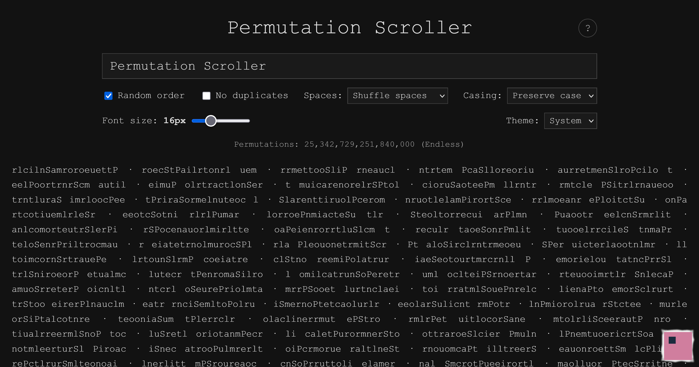

# Permutation Scroller

Permutation Scroller efficiently generates all letter permutations of your input text, allowing you to infinitely scroll through them.

This is useful for games or puzzles that involve rearranging letters such as Scrabble or cryptic crosswords, helping your brain discover the real words among the noise.

This tool is not an anagram solver and has no knowledge of which words are real. Using anagram solvers is considered cheating in some games or puzzles. Permutation Scroller is intentionally designed to be less useful than anagram solvers to potentially be considered fair use. It is up to you or your group to decide whether to allow this tool.

